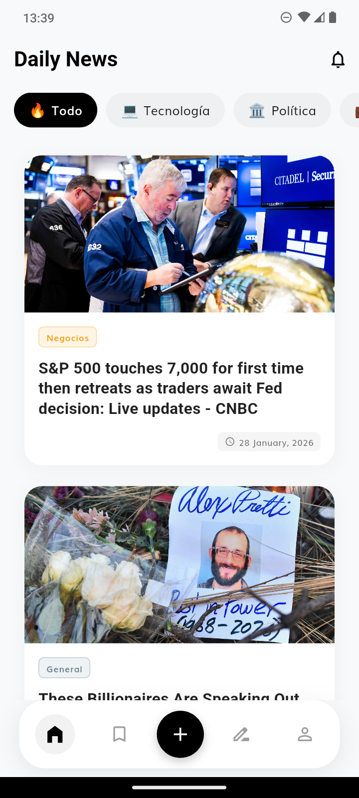

# 📰 Symmetry Applicant Showcase - Daily News App

Este repositorio contiene la solución integral para la prueba técnica de **Senior Flutter Developer**. La aplicación es un ecosistema de noticias moderno que integra Inteligencia Artificial, persistencia avanzada y una experiencia de usuario de alto nivel.
> 🎬 **[VER VIDEO DEMOSTRATIVO DEL PROYECTO](https://drive.google.com/file/d/1vR1uEXRSm-yWEjHGzwXFlkQIDoSW4En8/view?usp=sharing)**

---

## 📂 Estructura del Proyecto

El proyecto está organizado en tres módulos principales para facilitar la revisión:

* **[/frontend](./frontend):** Aplicación Flutter desarrollada con **Clean Architecture**. Incluye la lógica de UI, BLoc, y la integración con servicios de IA (Gemini) y Voz (TTS).
* **[/backend](./backend):** Configuración de **Firebase Firestore**, incluyendo el esquema de datos (Schema) y las reglas de seguridad.
* **[/docs](./docs):** Documentación técnica exhaustiva. Aquí encontrarás el **[REPORT.md](./docs/REPORT.md)** con el desglose de desafíos, arquitectura y overdelivery.

---

## 🚀 Quick Start (Inicio Rápido)

1.  **Backend:** Asegúrate de tener configurado tu proyecto en Firebase. (Ver [Backend README](./backend/README.md)).
2.  **Frontend:** * Crea un archivo `.env` en `frontend/` con tu `GEMINI_API_KEY`.
    * Ejecuta `flutter pub get` en la carpeta frontend.
    * Ejecuta `flutter run`.

---

## 🛠️ Stack Tecnológico Destacado

- **Estado:** Flutter BLoc / Cubit.
- **Persistencia Local:** Floor (SQLite) con soporte Offline-first.
- **IA:** Google Gemini Pro (Summaries & Translation).
- **Accesibilidad:** Text-to-Speech nativo bilingüe.
- **Arquitectura:** Clean Architecture con Inyección de Dependencias (GetIt).

---

## 👨‍💻 Autor
**Alext Santiago Davila Menez** - Senior Flutter Applicant