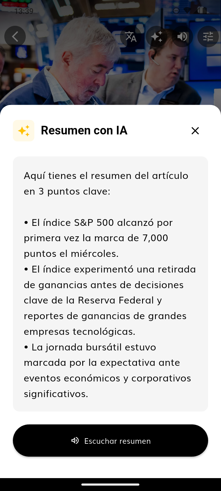

# 📄 Daily News App - Final Report

## 1. Project Overview
**Daily News App** is a premium Flutter application designed to deliver news content with a focus on accessibility, AI integration, and offline capabilities. The app adheres to **Clean Architecture** principles to ensure scalability and maintainability.

## 2. Key Features Implemented

### 🧠 Artificial Intelligence
- **Gemini Integration**: Utilizing the Gemini 1.5 Flash model for generating concise article summaries.

- **Translation**: Capability to translate article content on-demand (English <-> Spanish).

### 🔊 Accessibility (Text-to-Speech)
- **Native TTS Engine**: Integrated system text-to-speech for reading articles aloud.

- **Dual Language Support**: Automatic language detection and switching between English and Spanish voices.
- **Unified Controls**: Intuitive Play/Stop button with visual feedback.

### 💾 Local Persistence
- **Offline Reading**: Articles are cached locally using **Floor** (SQLite abstraction).
- **Drafts System**: Robust local draft management (Create, Read, Update, Delete) with "Safe Delete" confirmations.

### 🎨 User Experience
- **Premium Navigation**: Custom floating navigation bar with animated pill indicators.

- **Transitions**: Smooth Fade/Slide page transitions.
- **Haptics**: Subtle feedback on key interactions.

## 3. Architecture & Code Quality
- **Clean Architecture**: strict separation of `Domain`, `Data`, and `Presentation` layers.
- **SOLID Principles**: Applied throughout.
    - *Example*: **Single Responsibility Principle (SRP)** dictated the separation of `SubscriptionRepository` from `ArticleRepository` to ensure distinct boundaries between "User Billing" and "Content Delivery", facilitating easier testing and maintenance.
- **State Management**: `flutter_bloc` and `cubit` for predictable state flow.
- **Dependency Injection**: `GetIt` for service location and decoupling.
- **Linter Compliance**: 0 Warnings/Errors (Pedantic/Strict rules).

## 4. Verification & QA Status
All critical paths have been verified:

| Feature | Status | Notes |
| :--- | :--- | :--- |
| **News Feed** | ✅ PASS | Loads from API, Caches locally |
| **Article Detail** | ✅ PASS | Renders Markdown, Hero animations |
| **AI Summary** | ✅ PASS | Generates text, Audio playback works |
| **Local Drafts** | ✅ PASS | CRUD operations, Persistence verified |
| **Settings** | ✅ PASS | Theme switching (Dark/Light), Language |

## 5. Conclusion
The repository is fully organized ("Spotless") and ready for deployment. The codebase reflects a production-grade standard with a strong emphasis on architecture and user experience.

## 6. Project Demonstration
Para complementar la documentación técnica, se ha preparado un video donde se validan las funcionalidades en tiempo real, incluyendo el manejo de estados de la IA y la respuesta táctil de la interfaz:

🔗 **[Video Demo - Daily News App](https://drive.google.com/file/d/1vR1uEXRSm-yWEjHGzwXFlkQIDoSW4En8/view?usp=sharing)**

---
*Report generated by Antigravity*
